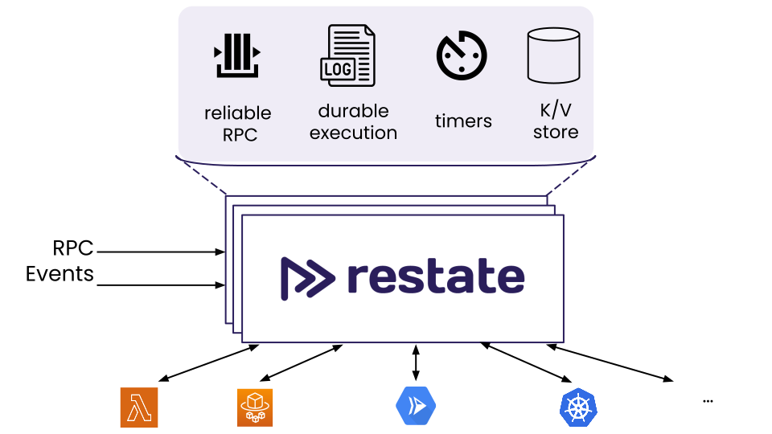
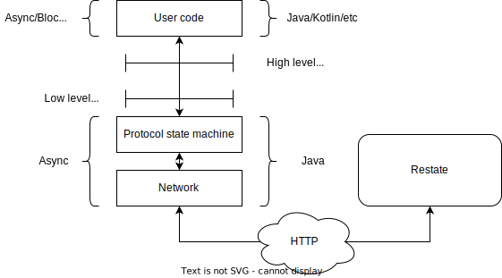

# Kotlinizing an asynchronous JVM library

## Our experience at Restate

---

## About me


:email: me@slinkydeveloper.com
:earth_africa: slinkydeveloper.com

Software Engineer from :it:

Berliner since ~2 years

Working at **Restate.dev**, previously Ververica, Red Hat

Former OSS committer of Eclipse Vert.x, Apache Flink

---

## Agenda

* Restate
* Adding Kotlin to the Restate Java SDK
* Java callbacks -> Kotlin coroutines
* Conclusions

---

## What is Restate?

<!-- Restate wants to provide developers a new experience for building backend applications -->
<!-- The Restate server, core component of the Restate project, gives you a set of fundamental primitives you need in most backend applications. -->
<!-- You interact with these primitives using SDKs -->
<!-- Restate solves most of the "hard" distributed systems problems, so you can focus on business logic --> 

---



<!-- Reliable RPC: Communication between Restate services is exactly once -->
<!-- Durable execution: If you crash, you resume from where you where -->
<!-- Reliable timers and scheduling -->
<!-- K/V store that services embed directly -->
<!-- Drive your services execution either by RPC or events -->
<!-- Deploy anywhere -->

---

### Example: Travel booking

```kotlin
suspend fun reserve(request: TravelBookingRequest) {
  val flightBookingId = flightsService
      .reserve(flightBookingRequest { tripId = request.tripID })
      .await()

  val paymentId = paymentService
      .process(paymentRequest { tripId = request.tripID })
      .await()

  flightsService
      .confirm(flightBookingId)
      .await()
}
```

<!-- Without restate: -->
<!-- * Make sure only one reserve is currently running per tripID -->
<!-- * What if transient failure after payment processed? -->
<!-- * What if process payment takes very long? -->
<!-- * Every service must be idempotent -->
<!-- * You need to model microservices interactions with async backchannel (e.g. kafka) -->

---

### Example: Travel booking

```kotlin
class TravelService : TravelRestateKt.TravelRestateKtImplBase() {
    suspend fun reserve(ctx: KeyedContext, request: TravelBookingRequest) {
        // ...
    }
}

fun main() {
    RestateHttpEndpointBuilder.builder()
        .withService(TravelService())
        .buildAndListen()
}
```

---

## Adding Kotlin to the [Restate Java SDK](https://github.com/restatedev/sdk-java)

<!-- Similar architecture to web servers -->

---



<!-- Explain requests coming from runtime, sdk needs to start user code -->
<!-- Explain user code uses an object provided by the sdk to send messages to the runtime --> 

---

_Low level_ state machine API:

```java
<T, R> void call(
    MethodDescriptor<T, R> callee, 
    T parameter, 
    Callback<R> callback
);
```

Java blocking user facing API:

```java
public <T, R> R call(MethodDescriptor<T, R> callee, T parameter);
```

Kotlin coroutines-based user facing API:

```kotlin
suspend fun <T, R> call(callee: MethodDescriptor<T, R>, parameter: T): R
```

---

### Analysis of the low level API

* What is the threading model of `call`?
  * `call` trampolines on the Vert.x Event loop...
* Where the callback runs?
  * ...callbacks run on Vert.x Event loop!
* Where is the user code entrypoint?
  * Entry point of request handlers is asynchronous and can be wrapped
* Do we need to propagate thread locals?
  * Logging relies on context propagation

---

## Java callbacks -> Kotlin coroutines

* Have a way to wrap all callback APIs to `suspend fun`
* Start a Kotlin coroutine executing the request handler
* Propagate contextual information

---

### From callback API to `suspend fun`

```kotlin
public interface Continuation<in T> {
    public fun resumeWith(result: Result<T>)
}
```

https://kotlinlang.org/api/latest/jvm/stdlib/kotlin.coroutines/-continuation/

---

### From callback API to `suspend fun`

```kotlin
// Some code before
callSuspendFun()
// Some code after
```

Compiles to:

```kotlin
// Some code before
callSuspendFun(object : Continuation {
    fn resumeWith(res: Result) {
        // Some code after
    }
})
```

---

### From callback API to `suspend fun`

```kotlin
suspend fun <T, R> call(
        callee: MethodDescriptor<T, R>, 
        parameter: T
): R = suspendCoroutine { continuation ->
    
    // Restate state machine callback
    val callback = object : Callback {
        override fun onCompleted(value: R) {
            continuation.resume(value)
        }
        override fun onError(cause: Throwable) {
            continuation.resumeWithException(cause)
        }
    }
    
    // Use the low level state machine API
    stateMachine.call(
            callee, 
            parameter, 
            callback
    )
}
```

---

### From callback API to `suspend fun`

```kotlin
class Restate(stateMachine: StateMachine) {
  suspend fun <T, R> call(
          callee: MethodDescriptor<T, R>,
          parameter: T
  ): R = /* ... */
}
```

---

### From callback API to `suspend fun`

```java
public Object call(
        MethodDescriptor callee, 
        Object parameter, 
        @NotNull Continuation $completion) {
  // Create child continuation
  final Continuation cont = new SafeContinuation(IntrinsicsKt.intercepted($completion));
  
  // Instantiate state machine callback
  Callback callback = new Callback() {
     public final void onCompleted(Object it) {
        cont.resumeWith(kotlin.Result(it));
     }

     public final void onError(Throwable it) {
        cont.resumeWith(kotlin.Result(ResultKt.createFailure(/*...*/)));
     }
  };
  
  // Invoke the state machine
  this.stateMachine.call(callee, parameter, callback);
  
  // Try to immediately poll result
  Object var10000 = cont.getOrThrow();
  
  // Suspend execution if no result yet
  return var10000 == IntrinsicsKt.getCOROUTINE_SUSPENDED() ? var10000 : Unit.INSTANCE;
}
```

---

### From callback API to `suspend fun`

* [`suspendCoroutine`](https://kotlinlang.org/api/latest/jvm/stdlib/kotlin.coroutines/suspend-coroutine.html) is thread safe
* `continuation` can be resumed only once!
  * Do as little as possible inside callbacks!

---

### Start user's request handler

```kotlin
// This is the user code we want to run
suspend fun <Req, Res> userRequestHandler(
    restate: Restate, 
    request: Req): Res {}
```

---

### Start user's request handler

```java
// This is the interface the Restate SDK request handler
// uses to invoke user request handlers
interface RestateRequestHandler<Req, Res> {
    void handleRequest(
        StateMachine stateMachine,
        Req request,
        Callback<Res> callback);
}
```

<!-- RestateKotlinAPI wraps the state machine low level api and converts all methods to suspend fun -->

---

### Start user's request handler

Some ingredients we need from Kotlin:

* [`CoroutineDispatcher`](https://kotlinlang.org/api/kotlinx.coroutines/kotlinx-coroutines-core/kotlinx.coroutines/-coroutine-dispatcher/): Object to start coroutines (like Java's `Executor`) 
* [`CoroutineContext`](https://kotlinlang.org/api/latest/jvm/stdlib/kotlin.coroutines/-coroutine-context/): Holds dispatcher + contextual data
* [`CoroutineScope`](https://kotlinlang.org/api/kotlinx.coroutines/kotlinx-coroutines-core/kotlinx.coroutines/-coroutine-scope.html): execution scope, for structured concurrency

<!-- CoroutineScope organizes coroutines in a tree like hierarchy -->

---

### Start user's request handler

```kotlin
fun handleRequest(
    stateMachine: StateMachine, 
    request: Req,
    callback: Callback<Res>) {
  // Prepare dispatcher, context and scope
  val dispatcher = Dispatchers.Default
  val context = EmptyCoroutineContext + dispatcher
  val scope = CoroutineScope(context)
    
  // Wrap in our suspend fun API
  val restate = Restate(stateMachine)
  
  // Launch the coroutine
  scope.launch { 
    try {
      val response = userRequestHandler(restate, request)
      callback.onSuccess(response)   
    } catch (e: Exception) {
      callback.onError(e)
    }
  }
}
```

---

### Start user's request handler

* Let the user pass a custom Context, default to the one makes most sense for the library architecture 
* Beware of the callback invoked in the coroutine dispatcher!
  * You might need to re-trampoline back on the execution context of the java library (e.g. `Vertx.runOnContext`)

---

### Propagate contextual data

* Many traditional Java libraries are based on thread locals.
* `CoroutineContext` is propagated by the Kotlin compiler in [`Continuation.context`](https://kotlinlang.org/api/latest/jvm/stdlib/kotlin.coroutines/-continuation/context.html).
* **Only from coroutines** you can access it using the intrinsic `coroutineContext`.
* Some Java libraries will let you plug a _context storage_, but you won't have access to the `coroutineContext` in there.

---

### (Option 1) Don't rely on contextual data propagation!
---

### (Option 2) Propagate manually `ContextElement` to `CoroutineContext`

---

### (Option 3) ThreadLocal propagation with [`ThreadContextElement`](https://kotlinlang.org/api/kotlinx.coroutines/kotlinx-coroutines-core/kotlinx.coroutines/-thread-context-element/)

```kotlin
public interface ThreadContextElement<S> : CoroutineContext.Element {
 
    public fun updateThreadContext(context: CoroutineContext): S
    
    public fun restoreThreadContext(context: CoroutineContext, oldState: S)
}
```

Interesting readings:

- [log4j2 approach](https://github.com/apache/logging-log4j-kotlin/tree/main/log4j-api-kotlin/src/main/kotlin/org/apache/logging/log4j/kotlin)
- [gRPC Context propagation](https://github.com/grpc/grpc-kotlin/blob/master/stub/src/main/java/io/grpc/kotlin/GrpcContextElement.kt)

<!-- With this approach the Java code reading/writing the context can still rely on Thread locals --> 

---

### (Option 3B) Propagate only one context when possible

* Java SDK propagates only one context through thread locals
* log4j2 reads that context and adds contextual info using a custom [`ContextDataProvider`](https://logging.apache.org/log4j/2.x/javadoc/log4j-core/org/apache/logging/log4j/core/util/ContextDataProvider.html) implementation 

---

## Conclusions

* Figure out how the Java library works first.
* Overlay the Java API using `suspendCoroutine` where possible.
* Stay un-opinionated about dispatchers & context, let the user inject what they want.
* Context propagation can work, requires some hacking around.
* Restate looks cool with Kotlin!

---

## Thank you!

---


- https://restate.dev
- https://docs.restate.dev
- https://github.com/restatedev/examples/tree/main/kotlin
- https://kotlinlang.org/docs/coroutines-basics.html
- https://kotlinlang.org/docs/coroutine-context-and-dispatchers.html
- https://kotlinlang.org/api/kotlinx.coroutines/kotlinx-coroutines-core/
